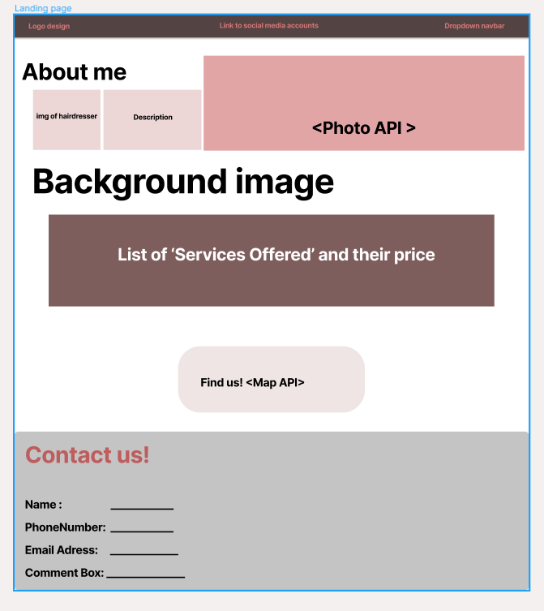

# Hairdresser Website

## Table of Contents

*  Project Description
*  User Story
*  Wireframe
*  APIs to be used
*  Rough breakdown of collaborators' tasks

---

## Project Description

Web application for a hairdresser’s clients. Her clients can visit this page to see the services she offers as well as her previous work through a collage of photos directly from the hairdresser’s Facebook page. Clients can leave their contact information so that the hairdresser can get in touch with them. The client's information will be saved in local storage to thank the client for their submission and to personalize the page for them for when they revisit. Clients can also look at the location of the salon with the option to navigate there with Google Maps. 


## User Story

```

AS A hairdresser's client
I WANT to visit this webpage
SO THAT I can see what services are offered
I WANT to see photos of the hairdresser’s work
SO THAT I can select a hair style for myself
I WANT to submit my contact information 
SO THAT I can get in touch with the hairdresser for an appointment
I WANT to see the salon’s location and options for navigation 
SO THAT I can find the salon
```

## Wireframe

The link to our wireframe can be found on Figma at the following link:
> [Figma Project1 Link](https://www.figma.com/file/CQvJu55Ah4v6Tz9nYmuzbH/Project-1?node-id=0%3A1)



## APIs to be used

* [Google Maps Driving Directions ](https://developers.google.com/maps/documentation/javascript/overview)

* [Facebook Photos API](https://developers.facebook.com/docs/graph-api/reference/album/photos/)

## Rough breakdown of collaborators' tasks

* Create HTML and apply CSS with Bulma- Miguel
* JavaScript- fetch request, navigation links - Ricky
* Local Storage - Ricky and Paola
* APIs research for url parameters and getting data for JSON response
    * Google Maps - Paola
    * Facebook Photos - Joseph

