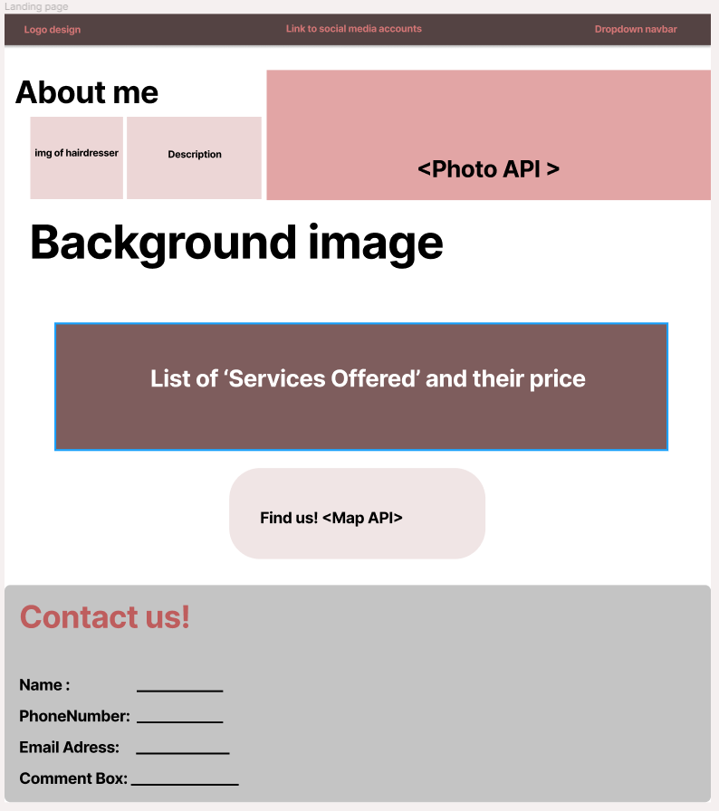

# Hairdresser Website

## Table of Contents

*  Project Description
*  User Story
*  Wireframe
*  APIs to be used
*  Rough breakdown of collaborators' tasks

---

## Project Description

Web application for a hairdresser’s customers. Her customers can visit this page to see the services she offers. Customers can leave their contact information so that the hairdresser can get in touch with them. The customer's information will be saved in local storage to thank the them for their submission and to personalize the page for when they revisit. Customers can also look at the location of the salon with the option to navigate there with Google Maps. The website has example photos of hairdressers' work obtained through the Pexel API.


## User Story

```
AS A hairdresser's client
I WANT to visit this webpage
SO THAT I can see what services are offered
I WANT to see photos of hairdressers' work
SO THAT I can select a hair style for myself
I WANT to submit my contact information 
SO THAT I can get in touch with the hairdresser for an appointment
I WANT to see the salon’s location and options for navigation 
SO THAT I can find the salon
```

## Wireframe

The link to our wireframe can be found on Figma at the following link:
> [Figma Project1 Link](https://www.figma.com/file/CQvJu55Ah4v6Tz9nYmuzbH/Project-1?node-id=0%3A1)



## APIs to be used

* [Google Maps API](https://developers.google.com/maps/documentation/javascript/overview)

* [Pexel API](https://www.pexels.com/api/documentation/)

## Rough breakdown of collaborators' tasks

* Figma Wireframe - Miguel
* Create HTML and apply CSS with Bulma- Miguel, Paola, Joseph, Ricky
* Local Storage Functions- Paola
* APIs research for url parameters, fetch requests, and appending
    * Google Maps - Paola
    * Pexel API - Joseph
* Webpage links and extra details - Joseph

